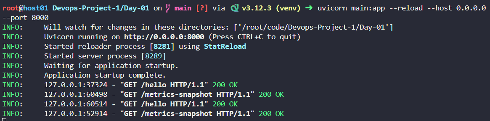

# My DevOps FastAPI App

My minimal FastAPI application demonstrating **DevOps best practices** such as containerization readiness, monitoring with Prometheus, and CI/CD preparation.

---

## Overview

This app provides:

- **Health check**: `/health` → returns `{"status":"ok"}` or `{"status":"fail"}` depending on `/fail` or `/recover` calls. Used by readiness probe.
- **Demo endpoint**: `/hello` → basic endpoint for generating traffic. Can also be used for liveness probe.
- **Prometheus metrics**: `/metrics` → exposes metrics for monitoring requests and latency.
- **Metrics snapshot**: `/metrics-snapshot` → developer-friendly snapshot of current request counts (local testing only).
- **Fail endpoint**: `/fail` (POST) → sets `/health` to fail (HTTP 500), simulating a pod NotReady state.
- **Recover endpoint**: `/recover` (POST) → restores `/health` to OK (HTTP 200), marking pod Ready.
- **Crash endpoint**: `/crash` (POST) → kills the application process immediately, triggering the liveness probe to restart the container.

All metrics are collected via middleware to track request counts and latency.

---

## Endpoints

| Endpoint            | Method | Description |
|--------------------|--------|-------------|
| `/health`           | GET    | Returns health status. Can return `{"status":"ok"}` or `{"status":"fail"}` depending on `/fail` or `/recover` calls. Used by **readiness probe**. |
| `/hello`            | GET    | Sample endpoint for generating traffic. Used by **liveness probe**. |
| `/metrics`          | GET    | Prometheus metrics endpoint for monitoring request counts and latency. |
| `/metrics-snapshot` | GET    | Developer-friendly snapshot of current request counts (local testing only). |
| `/fail`             | POST   | Sets the `/health` endpoint to return HTTP 500 → simulates pod not ready. |
| `/recover`          | POST   | Restores `/health` endpoint to return HTTP 200 → pod marked Ready again. |
| `/crash`            | POST   | Immediately kills the application process → triggers **liveness probe** to restart the container. |

The last three end-points `/fail`,`/recover` and `/crash` ar used extensively in [Day-03](https://github.com/Janemils/Devops-Project-1/tree/main/Day-03) to test out the liveness probe and the readiness probe.

============================================================================================================================================

HOW TO RUN THIS APP IN YOUR LOCAL:-

- Install dependencies:

pip install -r requirements.txt

============================================================================================================================================
- Run the app:

uvicorn main:app --reload --host 0.0.0.0 --port 8000

============================================================================================================================================

- Test endpoints:

# Health check
curl http://localhost:8000/health

# Basic hello endpoint
curl http://localhost:8000/hello

# Prometheus metrics
curl http://localhost:8000/metrics

# To fail the health check:
curl -X POST http://localhost:8000/fail

# To recover the failed health check:
curl -X POST http://localhost:8000/recover

# To crash the application (i.e; just kill the process)
curl -X POST http://localhost:8000/crash

# Debugging: current counts.
This endpoint is purely for debugging purpose only. Use it to validate if the http_request counts are being incremented successfully.

curl http://localhost:8000/metrics-snapshot
