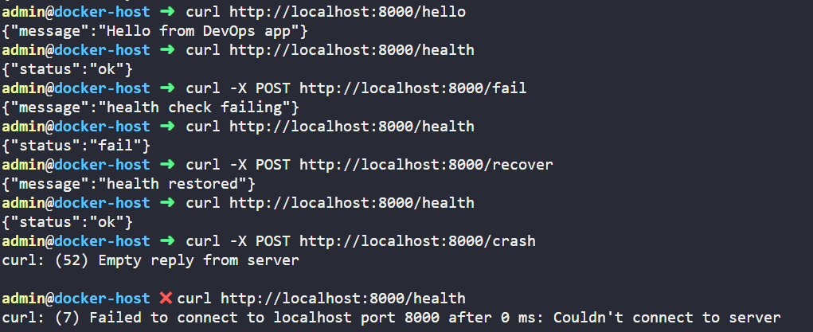

# Day 02 – Dockerizing FastAPI App.

## Overview

On Day 02, we containerized the FastAPI application from Day 01 using a **multi-stage Docker build**. The goal is to create a small, efficient runtime image while keeping the build dependencies separate.

This container can run the FastAPI app and expose Prometheus metrics for monitoring.

---

## Dockerfile Explanation (Line-by-Line)

**Stage 1 – Builder Stage**

1. **Base image**: We use `python:3.11-slim` as the base for building dependencies. It’s lightweight and includes Python.  
2. **WORKDIR /app**: Sets the working directory inside the container. All subsequent commands run relative to this path.  
3. **Copy requirements.txt**: Only the dependencies file is copied first to optimize layer caching. From our Day-01, this would be the requirement.txt.  
4. **Install dependencies**: `pip install --prefix=/install -r requirements.txt` installs Python dependencies in a separate directory (`/install`) to keep the runtime image clean.

**Stage 2 – Runtime Stage**

5. **Base image**: We start again with a fresh `python:3.11-slim` image to reduce the final image size.  
6. **WORKDIR /app**: Sets the working directory for the runtime container.  
7. **Copy installed dependencies**: Dependencies from the builder stage are copied into `/usr/local` in the runtime image.  
8. **Copy application code**: All the app files (`main.py`, `metrics.py`) are copied into the runtime image.  
9. **Expose port 8000**: The container listens on port 8000 for incoming traffic.  
10. **Start the app**: `uvicorn` runs the FastAPI application, listening on all network interfaces (`0.0.0.0`) at port 8000.  

> **Key Idea:** Multi-stage builds separate the heavy build environment from the runtime environment, reducing image size and improving security.

---

## Building the Docker Image  

Ensure you have Docker installed in your workspace. Clone the repository and from the `Devops-Project-1/` folder, run:

```bash
# Clone the repository:
admin@docker-host ➜  git clone https://github.com/Janemils/Devops-Project-1.git
Cloning into 'Devops-Project-1'...
Username for 'https://github.com': <enter-your-username>
Password for 'https://<username>@github.com': <enter-your-PAT>
remote: Enumerating objects: 294, done.
remote: Counting objects: 100% (123/123), done.
remote: Compressing objects: 100% (77/77), done.
remote: Total 294 (delta 54), reused 79 (delta 28), pack-reused 171 (from 1)
Receiving objects: 100% (294/294), 18.30 MiB | 31.02 MiB/s, done.
Resolving deltas: 100% (95/95), done.

# To build your Dockerfile.
admin@docker-host ➜  cd Devops-Project-1/

admin@docker-host ➜  docker build -t fast-api:latest_img -f Day-02/Dockerfile .
[+] Building 11.0s (11/11) FINISHED                                           docker:default
 => [internal] load build definition from Dockerfile                                    0.1s
 => => transferring dockerfile: 447B                                                    0.0s
 => [internal] load metadata for docker.io/library/python:3.11-slim                     0.6s
 => [internal] load .dockerignore                                                       0.1s
 => => transferring context: 2B                                                         0.0s
 => [internal] load build context                                                       0.1s
 => => transferring context: 66.49kB                                                    0.0s
 => [builder 1/4] FROM docker.io/library/python:3.11-slim@...............               2.0s
............
 => [builder 2/4] WORKDIR /app                                                          0.7s
 => [builder 3/4] COPY Day-01/requirements.txt .                                        0.1s
 => [builder 4/4] RUN pip install --prefix=/install -r requirements.txt                 6.2s
 => [stage-1 3/4] COPY --from=builder /install /usr/local                               0.3s 
 => [stage-1 4/4] COPY Day-01/ .                                                        0.1s 
 => exporting to image                                                                  0.2s 
 => => exporting layers                                                                 0.2s 
 => => writing image .....................                                              0.0s 
 => => naming to docker.io/library/fast-api:latest_img                                  0.0s 
```  

---  

```bash
# Verify your image.
admin@docker-host ➜  docker images
REPOSITORY   TAG          IMAGE ID       CREATED              SIZE
fast-api     latest_img   521b3df44104   About a minute ago   140MB

# Run your image with an appropriate tag and expose the ports.
admin@docker-host ➜  docker run --name fastapi-app -p 8000:8000 fast-api:latest_img 
INFO:     Started server process [1]
INFO:     Waiting for application startup.
INFO:     Application startup complete.
INFO:     Uvicorn running on http://0.0.0.0:8000 (Press CTRL+C to quit)
```


---

Now that your app is running, you can test out your endpoints to cross-verify:



---

## Push the image to the registry.
We will be using the dockerhub registry. <https://hub.docker.com/>

```bash
# Login to your docker account.
admin@docker-host ➜  docker login

USING WEB-BASED LOGIN
To sign in with credentials on the command line, use 'docker login -u <username>'

Your one-time device confirmation code is: .........

# Follow as per the rest of the steps to login.
```

```bash
# Tag your image that you want to push to your registry and push the image.
admin@docker-host ➜  docker tag fast-api:latest_img janemils/janemils-app:fastapi-<version-number>
admin@docker-host ➜  docker push janemils/janemils-app:fastapi-<version-number>
```
  
## Validate, whether your image actually got pushed to the registry:

  


**This step is important for day-03 as we will be using the image from the registry.**


